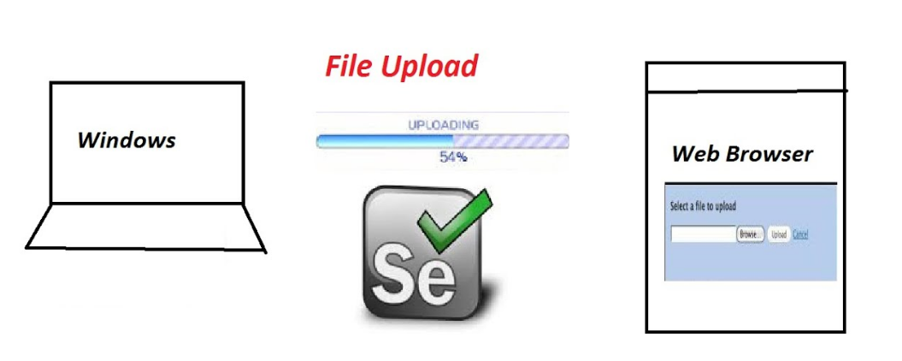

# Selenium Webdriver ile File upload Yöntemleri
,

>- Dosya yükleme işlemleri, web uygulamalarında önemli bir özelliktir ve otomasyon testleri için de oldukça önemlidir. 
>- Selenium WebDriver, bu işlemleri kolaylaştırmak için birçok yöntem sunar. 
>- Bunlar arasında en yaygın kullanılanları sendKeys() metodu ve setFileDetector() metodu olarak sıralanabilir. 
>- Ayrıca, Robot sınıfı ve AutoIT aracı gibi diğer araçlar da kullanılabilir. 
>- Bu yöntemlerin her biri farklı avantajlara sahiptir ve test senaryolarına göre seçilebilir.

>- Umarım faydalı bir paylaşım olur.
  
    